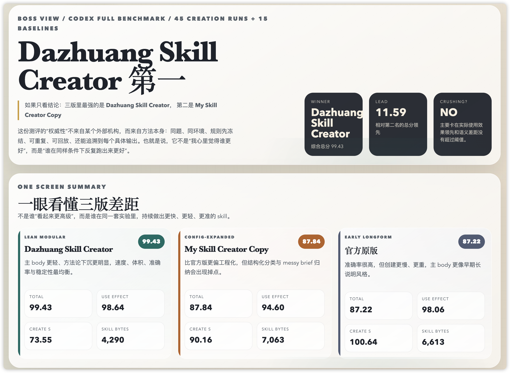

# Dazhuang Skill Creator

[中文文档](README.zh-CN.md) | English | [Changelog](CHANGELOG.md)



> Official original = Claude Code's official `skill-creator`  
> `My Skill Creator Copy` = my second iteration  
> `Dazhuang Skill Creator` = the final version in this repo

Dazhuang Skill Creator starts from Claude Code's official `skill-creator`, then rebuilds it with a stronger view of prompt architecture, skill architecture, and how CLI tool execution actually behaves in real usage.

This is not just a wording tweak. I reworked the workflow, structure, bundled resources, and maintenance model so the generated skill is easier to evolve, easier to debug, and easier to collaborate on over time.

> Update `v2.0.0` (2026-04-11): this major release introduces memory modes (`off` / `adaptive` / `lessons` / `auto`), lesson-to-hard-rule promotion, stricter memory invariants in `quick_validate.py`, and regression coverage for no-rehire behavior.

For evaluation, I used Codex in headless mode - no GUI, no need to open the CLI page, just terminal execution - and ran at least 3 independent conversation tests per benchmark item. The full benchmark standards and archived reports are included in `测评报告/`.

If this project is useful to you, please consider giving it a star. For contact or collaboration:

- WeChat: `yinyinGyL`
- Email: `372749817@qq.com`

## What Was Benchmarked

### 1. Five task-type capability comparisons

- A | Content creation - whether prompts, templates, and platform style can be organized into reusable skills
- B | Structured output - whether the skill can follow a strict JSON schema and keep the output stable
- C | Tool research - whether it reads source files, cites evidence, and avoids hand-wavy summaries
- D | Script execution - whether the generated scripts actually run and fail safely when needed
- E | Hybrid orchestration - whether prompt, reference, asset, and script layers work together coherently

### 2. Five capability archetype comparisons

- Minimal compressed output
- Strict structured output
- Safety judgment
- Template-based abstraction
- Dirty-input normalization

## Evaluation Method

- Benchmarks were run with Codex headless mode in the terminal
- Each case was tested with at least 3 independent conversations
- The 3-version capability-archetype benchmark compared:
  - Claude Code official `skill-creator`
  - `My Skill Creator Copy` as the second iteration
  - `Dazhuang Skill Creator` as the final version
- The archived reports include:
  - `45 creation runs + 15 baselines` for the 3-version benchmark
  - `30 creation runs + 15 baselines` for the head-to-head task-type benchmark
- Source directory integrity checks remained clean during benchmarking (`manifest diff = 0`)

## Evaluation Dimensions

The benchmark scoring rolls up into five top-level dimensions:

- Process efficiency
- Precision
- Product quality
- Actual-use effect
- Stability

## Results

### Overall conclusion

- `Dazhuang Skill Creator` ranks first in both benchmark sets archived in this repo
- In the 3-version capability-archetype benchmark, the final version wins with a total score of `99.43`
- In the head-to-head task-type benchmark, the final version beats the official original with a total score of `99.44` vs `96.20`
- The result is a clear overall win, but not a "crushing" win according to the benchmark's own verdict rule

### 3-version capability-archetype benchmark

| Version | Total | Actual Use | Process | Precision | Quality | Stability |
| --- | ---: | ---: | ---: | ---: | ---: | ---: |
| Dazhuang Skill Creator | 99.43 | 98.64 | 100.00 | 99.53 | 100.00 | 100.00 |
| My Skill Creator Copy | 87.84 | 94.60 | 84.25 | 97.55 | 94.39 | 0.00 |
| Claude Code official `skill-creator` | 87.22 | 98.06 | 77.18 | 100.00 | 90.72 | 0.00 |

Key takeaways:

- Final version leads the runner-up by `11.59` points
- Final version achieves `100.0` downstream semantic accuracy in this benchmark set
- Final version is also the smallest of the three by average skill size (`4,290` bytes vs `7,063` and `6,613`)

### 5 task-type benchmark: final version vs official original

| Task Type | Official | Dazhuang | Result |
| --- | ---: | ---: | --- |
| A - Content creation | 100.00 | 100.00 | Tie |
| B - Structured output | 100.00 | 100.00 | Tie |
| C - Tool research | 98.89 | 100.00 | Dazhuang leads |
| D - Script execution | 100.00 | 100.00 | Tie |
| E - Hybrid orchestration | 83.72 | 83.82 | Dazhuang leads slightly |

Additional head-to-head results:

- Total score: `99.44` vs `96.20`
- Actual-use effect: `100.00` vs `98.08`
- Process efficiency: `97.74` vs `89.37`
- Downstream semantic accuracy: `96.76` vs `96.52`
- Runtime validation: both versions scored `100.0`

## Why This Version Is Easier To Maintain

Compared with the original version, this repo puts more emphasis on maintainable structure:

- Keep the main `SKILL.md` centered on durable rules and workflow
- Keep single-file skills inside a fixed section whitelist: `角色`, `规则`, `工作流程`, `例子`, `输出格式`, `索引`
- Treat `例子` as model-facing internal references, not user prompt examples; treat `输出格式` as model-facing templates
- Push long explanations into `references/`
- Put reusable templates into `assets/`
- Put deterministic or repetitive work into `scripts/`
- Keep frequently adjusted defaults in `config.yaml`

That makes follow-up iteration much easier. The original version can become hard to modify once generated, while this version is designed to remain editable and team-friendly over time.

## Default Strategy For Existing Skills

This repo no longer treats "optimize an existing skill" as "just tweak the `description`", and it does not treat refactoring as a separate methodology either.

- Creation and refactoring follow the same blueprint; the difference is whether you start from scratch or reorganize material from an old skill
- First diagnose whether the real issue is triggering, structure, or both
- If the old skill is bloated, scattered, or easy to derail across long contexts, default to structural refactoring so it realigns with the Dazhuang architecture
- Only run trigger eval / description optimization after the skill body itself is structurally sound
- The goal is alignment with the same blueprint, not mechanically forcing every skill into the same template; simple skills can still stay single-file

## Project Structure

- `SKILL.md` - the final Dazhuang Skill Creator skill definition
- `VERSION` - the local creator version marker used by the runtime update check
- `agents/` - benchmark and comparison agent prompts
- `references/` - architecture notes, evaluation workflow, packaging guidance, internal examples, and schemas
- `assets/` - model-facing templates, reusable assets, and report templates
- `scripts/` - initialization, validation, update checking, evaluation, optimization, reporting, and packaging tools
- `config.yaml` - editable defaults for init, update checking, evaluation, optimization, and packaging
- `测评报告/` - archived benchmark reports and screenshots

## Quick Start

### Install into a Claude Code / Codex / Open Claude skill directory

The recommended install path is `git clone`, because runtime update checks and auto-update both rely on a real git working tree.

```bash
cd <your-skill-dir>
git clone https://github.com/DazhuangJammy/DazhuangSkill-Creator.git
```

If you ask another AI to install this repo for you, be explicit:

- use `git clone https://github.com/DazhuangJammy/DazhuangSkill-Creator.git`
- do not just download a zip
- do not just copy the folder contents
- do not remove `.git`

Standard prompt for Claude / Codex / other installation-oriented AIs:

```text
Please install this skill into my skill directory, and you must use git clone.

Repository:
https://github.com/DazhuangJammy/DazhuangSkill-Creator.git

Requirements:
1. Use git clone, not a zip download
2. Do not just copy the folder contents
3. Keep the .git directory intact
4. Confirm the installed directory is a normal git working tree
5. If the target directory already exists, tell me first before deciding whether to pull or reinstall
```

### Create a new skill scaffold

On Windows, replace `python3` with `py -3` (preferred) or `python`.

```bash
python3 scripts/init_skill.py my-skill --path ./out
```

If a single-file skill needs extra inline modules, declare them explicitly:

```bash
python3 scripts/init_skill.py my-judge-skill --path ./out --sections role,output-format
```

Memory modes:

- `off`: no memory layer
- `lessons`: enable memory pipeline from day one (`memory-state` + `memory-events` + `memory-lessons`)
- `adaptive`: start without memory, then auto-enable after repeated runtime friction
- `auto` (default): classify before scaffold creation and choose `off` / `adaptive` / `lessons`

These `memory_*` settings in `config.yaml` are scaffold defaults for generated skills only; they do not turn on memory for this creator repo itself.

If you want to force memory from day one, enable lessons mode:

```bash
python3 scripts/init_skill.py my-review-skill --path ./out --memory-mode lessons
```

If you want pre-creation auto-classification, provide intent text:

```bash
python3 scripts/init_skill.py my-analysis-skill --path ./out --memory-mode auto --intent "high-variance analysis with iterative refinement"
```

If you want runtime auto-enable, use adaptive mode:

```bash
python3 scripts/init_skill.py my-analysis-skill --path ./out --memory-mode adaptive
```

Both `lessons` and `adaptive` add `scripts/memory_mode_guard.py`, `references/memory-state.json`, and `references/memory-events.jsonl`.

- `lessons`: starts with memory enabled; repeated failure signatures are promoted into lessons.
- `adaptive`: starts disabled; reaches thresholds, then auto-enables lessons.
- In both modes, stable lessons are promoted into a `MEMORY_HARD_RULES` block inside generated `SKILL.md`.

### Validate a skill

```bash
python3 scripts/quick_validate.py ./out/my-skill
```

`quick_validate.py` now also enforces memory-skill invariants (when memory files are detected): `MEMORY_HARD_RULES` markers, Step 1/Step 4 guard commands, and required memory runtime files.

### Manually check creator updates

```bash
python3 scripts/check_update.py --force
```

### Refactor an existing skill

- The refactor still follows the same blueprint used for new skills; it just starts by extracting what is worth keeping from the old skill
- First classify the intervention level as `light optimization`, `structural refactor`, or `full overhaul`
- If the problem is structural bloat, path drift, or losing the main line in long contexts, refactor `SKILL.md` and rebalance `references/`, `assets/`, and `scripts/` first
- Only move on to the trigger workflow after the structure is stable

### Evaluate triggering behavior

```bash
python3 scripts/run_eval.py --eval-set ./path/to/eval-set.json --skill-path ./out/my-skill
```

### Run the optimization loop

Use this only after the skill body is already structurally sound:

```bash
python3 scripts/run_loop.py --eval-set ./path/to/eval-set.json --skill-path ./out/my-skill
```

### Package a skill

```bash
python3 scripts/package_skill.py ./out/my-skill ./dist
```

## Runtime Update Check

This repo now ships with a lightweight self-update path that hangs off Step 1 of the creator skill:

- Recommended source: `https://github.com/DazhuangJammy/DazhuangSkill-Creator.git`
- Recommended install mode: `git clone` into the target skill directory
- Every real invocation of the skill starts by running `scripts/check_update.py`
- By default it checks the network at most once every `24` hours
- When a new version is found, it reminds once, then stays quiet until an even newer version appears
- The default config already enables `update_check.auto_update: true`; as long as the current install is a clean git clone, the script will try `git pull --ff-only`
- If the skill was installed by manually copying the folder, or the working tree has local edits, the script falls back to reminder-only mode
- Even after a successful auto-update, the refreshed files fully apply on the next invocation of the skill; the current run continues with the already loaded version

Minimal config:

```yaml
update_check:
  enabled: true
  interval_hours: 24
  auto_update: true
```

If you prefer to disable auto-update explicitly:

```yaml
update_check:
  enabled: true
  auto_update: false
  interval_hours: 24
```

## Benchmark Reports

You can inspect the archived benchmark outputs here:

- `测评报告/5 个能力原型对比/`
- `测评报告/5 个类型性能对比/`
- `测评报告/iShot_2026-04-04_12.17.26.png`

## License

Apache 2.0. See `LICENSE` and `LICENSE.txt`.
